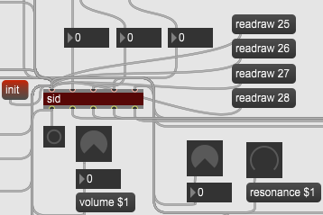

# sid-object

#### a Max/MSP C-external for SIDBlaster-USB hardware

This object allows full access to a real SID-Chip.

Installation:
-------------
- copy SID-object folder to
 ...\documents\Max 7\packages or to ...\documents\Max 8\packages

- copy the appropriate DLL into the program directory of Max

- study the attached Max patchs for the feature learning and reference page

versions history
----------------
* v.0.9.9 2020-07-09
	- some clean up; final 1.0 release candidate
* v.0.9.5 2020-07-08
	- change sleeptime from 20ms to 1ms; some clean up
* v.0.9.2 2020-07-07
	- add getinfo
* v.0.9.1 2020-07-04
	- needs hardsid.dll 0x0202; fix read functions
* v.0.9 2020-05-11
	- implemented the raw-mode; read functions
* v.0.8.1 2020-05-07
	- Improvement of error messages: "Real" errors are reported to the MAX console. The messages follow a     system so that they can be parsed in MAX.
* v.0.8 2018-10-24
	- add instance management; lock/unlock; better threading and multitasking; better multidevice, up to 8 devices tested
* v.0.1 started at 2016-12-06

see: [https://github.com/gh0stless/AIASS-for-MAX4LIVE](https://github.com/gh0stless/AIASS-for-MAX4LIVE/) for a Synthesizer that use that object.

see: [https://github.com/gh0stless/SIDBlaster-USB-Tic-Tac-Edition](https://github.com/gh0stless/SIDBlaster-USB-Tic-Tac-Edition) for SIDBlaster-USB hardware.

see: [https://github.com/Galfodo/SIDBlasterUSB_HardSID-emulation-driver](https://github.com/Galfodo/SIDBlasterUSB_HardSID-emulation-driver) for hardsid.dll.

(Unfortunately only for Windows at the moment.)

Thanks to:

*Stein Pedersen and Wilfred Bos for there support.

##### Copyright © 2016-2020 [www.crazy-midi.de](http://www.crazy-midi.de)

Andreas Schumm (gh0stless)
contact: info@crazy-midi.de