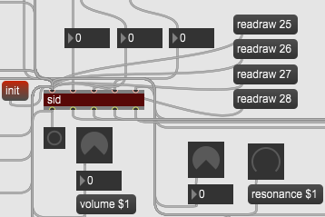

# sid-object

#### a Max/MSP C-external for SIDBlaster-USB hardware

This object allows full access to a real SID-Chip.

Installation:
-------------
copy the SID.mxe and or SID.mxe64 to
...\documents\Max 7\Library
or the SID.mxe64 to
...\documents\Max 8\Library

copy the appropriate DLL into the program directory of Max

study the attached Max patch for the feature learning

versions history
----------------
v.0.9.0 2020-05-11
- implemented the raw-mode
- read functions

v.0.8.1 2020-05-07
- Improvement of error messages: "Real" errors are reported to the MAX console. The messages follow a     system so that they can be parsed in MAX.

v.0.8
- better threading and multitasking
better multidevice, up to 8 devices tested

see: [https://github.com/gh0stless/AIASS-for-MAX4LIVE](https://github.com/gh0stless/AIASS-for-MAX4LIVE/) for a Synthesizer that use that object.

see: [https://github.com/gh0stless/SIDBlaster-USB-Tic-Tac-Edition](https://github.com/gh0stless/SIDBlaster-USB-Tic-Tac-Edition) for SIDBlaster-USB hardware.

see: [https://github.com/Galfodo/SIDBlasterUSB_HardSID-emulation-driver](https://github.com/Galfodo/SIDBlasterUSB_HardSID-emulation-driver) for hardsid.dll.

(Unfortunately only for Windows at the moment.)

Thanks to:

*Stein Pedersen and Wilfred Bos for there support.

##### Copyright © 2020 [www.crazy-midi.de](http://www.crazy-midi.de)

Andreas Schumm (gh0stless)
contact: info@crazy-midi.de